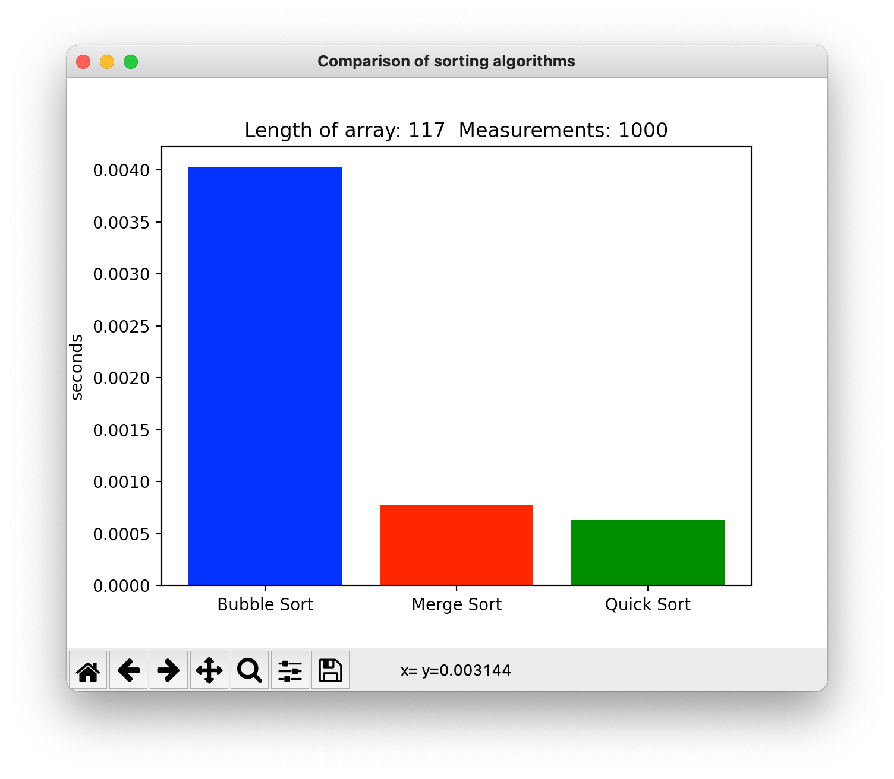

# Sorting Algorithms
I have implemented three sorting algorithms in Python, Bubble sort, Merge sort and Quick sort.

Each of the algorithms can be run independently or run via the comparison script.

To run Bubble Sort individually type (from within the src folder)
```
python3 Bubble_Sort.py
```

To run Merge Sort individually type (from within the src folder)
```
python3 Merge_Sort.py
```

To run Quick Sort individually type (from within the src folder)
```
python3 Quick_Sort.py
```



To run the comparison script type (from within the src folder)
```
python3 Compare.py
```

**Matdoz, June 2021**
